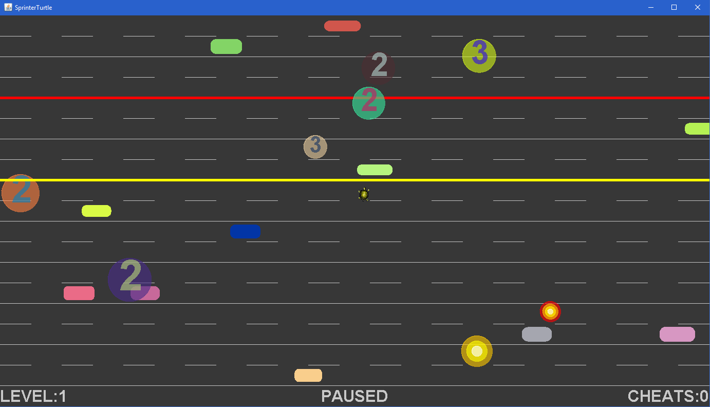

# Sprinter Turtle

2D top down road crossing game.

Also works as a beautiful simulation when probabilites are increased.

## Gameplay & Features

* There are 6 main entities in this game.
  * Explosion
    * They appear after trains and vehicles are exploded by meteors, rockets and mouse clicks.
    * They are not opaque so any entity below them is visible.
    * They do not block any movement of any entity.
    * They have 4 different phases with 4 different colors.
    * Their sizes grow linearly with the entities are exploded within them.
  * Meteor
    * They appear in random sizes and random positions from time to time.
    * They have random colors.
    * They are not opaque so any entity below them is visible.
    * They do not block any movement of any entity.
    * Time to hit to the ground is visible on them.
    * Until they disappear they have no effect but by the time they disappear
    they explode trains, vehicles and the turtle if they are below meteor.
  * Rocket
    * Turtle can launch rockets to explode trains and vehicles.
    * They are opaque and have random colors.
  * Train
    * They appear between lanes randomly from time to time.
    * They have two phases.
      * Warning phase
        * It is the first phase of the train.
        * They are opaque and yellow.
        * They do not block any movement of any entity. (If turtle touches them, it does not die.)
        * They cannot explode by meteors and rockets.
        * After this phase, actual train comes.
      * Train phase
        * It is the second (last) phase of the train.
        * They are opaque and red.
        * They block the vertical movement of the turtle. (If turtle touches them, it dies.)
        * They can explode by meteors and rockets and creates explosions.
  * Turtle
    * Main entity in this game.
    * Only user controllable entity in this game.
    * It can be moved by keyboard and mouse.
    * It turns to left and right when it moves in these directions.
    * It can launch rockets to explode trains and vehicles.
    * It stays in the safe zone in the beginning.
    * It tries to reach the top without touching any trains and vehicles.
    * After touching the top, it flips vertically then it tries to reach the safe zone.
    * After reaching the safe zone, it again flips vertically.
    * Reaching the safe zone again completes one level.
    * By completion of one level, turtle and vehicle speeds are
    increased by their respective speed increments, other things do not change.
  * Vehicle
    * They appear in random sizes and random positions from time to time.
      * Each of them have different width, height, arc and speed.
      * They can be spawned in any lane in any direction.
      * They are opaque and have random colors.
    * They block the movements of the turtle. (If turtle touches them, it dies.)
    * They can explode by meteors and rockets and creates explosions.

## Controls

* Move the turtle by mouse or _W, A, S, D_ keys.
* Pause the game by pressing _P_.
* Pausing automatically when window loses focus.
* View the detailed cheats information by pressing _I_.
* Reset the turtle to safe zone by preesing _R_.
* Clear all trains and vehicles from the board by pressing _C_.
* Explode trains and vehicles by left click.
* Launch rockets by pressing _UP, DOWN, LEFT, RIGHT_ keys.
* Launch rockets in the direction of mouse by right click.
* Drag the turtle in paused mode without dying by pressing _CONTROL_ and moving the mouse.

There are some customization options for adding variety.
You can set these options using _SprinterTurtleConfiguration.ini_ file after building
(Hard-coding options into code is not necessary).

## Customizations

* Specify the lane height and line width.
* Choose how many lanes and lines will be on the baord.
* Set how many frames appear in one second.
* Choose how many pixels the elements move in one second by default.
(If you want to change the speed of all elements,
change this otherwise use that element's speed multiplier.)
* Select the background color (colors of the labels and lines are the inverse of this color).
* Select what happens when turtle dies (hopefully not soon:smile:).
  * Exits the game.
  * Continues the game from safe zone and adds one to cheats.
* Select the control type (mouse or keyboard).
* Specify label size and lane gap height.
* Choose the starting level.
* Specify
  * Alpha values of the colors of explosion and meteor.
  * Durations of explosion, meteor, train warning and train.
  * Size multipliers of explosion, meteor, rocket, train, turtle and vehicle.
  * Highest and lowest sizes of meteor and vehicle.
  * Spawning probabilites of meteor, train, and vehicle.
  * Long vehicle probability and size multiplier.
  * Speed multipliers of rocket, turtle and vehicle.
  * Highest and lowest speeds of vehicle.
  * Speed increments of turtle and vehicle per round.
  * Turtle turn multiplier and maximum turn.